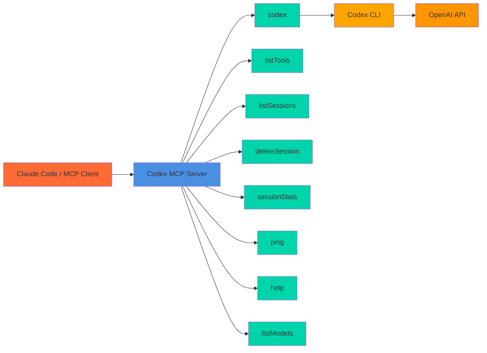

# Codex MCP Server

MCP server wrapper for the OpenAI **Codex CLI** that lets **Claude Code** (and any MCP‑compatible client) use Codex locally via stdio.



## Prerequisites

- **OpenAI Codex CLI** installed & configured  
  - Install: `npm i -g @openai/codex` or `brew install codex`  
  - Setup: `codex login` or set `OPENAI_API_KEY`
- **Claude Code** (or another MCP client)

## Installation

### One‑Click Installation

#### VS Code

[](https://vscode.dev/redirect/mcp/install?name=codex-cli&config=%7B%22type%22%3A%22stdio%22%2C%22command%22%3A%22npx%22%2C%22args%22%3A%5B%22-y%22%2C%22%40comfucios%2Fcodex-mcp-server%22%5D%7D)

#### VS Code Insiders

[](https://insiders.vscode.dev/redirect/mcp/install?name=codex-cli&config=%7B%22type%22%3A%22stdio%22%2C%22command%22%3A%22npx%22%2C%22args%22%3A%5B%22-y%22%2C%22%40comfucios%2Fcodex-mcp-server%22%5D%7D)

#### Cursor

[](https://cursor.com/en/install-mcp?name=codex&config=eyJ0eXBlIjoic3RkaW8iLCJjb21tYW5kIjoibnB4IC15IEBjb21mdWNpb3MvY29kZXgtbWNwLXNlcnZlciIsImVudiI6e319)

### Manual Installation

#### Claude Code (CLI)

```bash
claude mcp add codex-cli -- npx -y @comfucios/codex-mcp-server
```

#### Claude Desktop

Add to your Claude Desktop configuration file:

**macOS:** `~/Library/Application Support/Claude/claude_desktop_config.json`  
**Windows:** `%APPDATA%/Claude/claude_desktop_config.json`

```json
{
  "mcpServers": {
    "codex-cli": {
      "command": "npx",
      "args": ["-y", "@comfucios/codex-mcp-server"]
    }
  }
}
```

## Advanced Features & Tips

- **Graceful shutdown** — Handles SIGINT/SIGTERM so clients don’t see abrupt disconnects.
- **Pagination** — Large outputs are chunked; use `nextPageToken`/`pageToken`. Default size via `CODEX_PAGE_SIZE`.
- **Session memory** — Pass `sessionId` to keep context; sessions expire after `CODEX_SESSION_TTL_MS` and trim when exceeding `CODEX_SESSION_MAX_BYTES`.
- **Tool discovery** — Use `listTools` to get all tools with schemas (handy for client introspection).
- **Image input** — The `codex` tool supports `image` paths (single or array) for code/diagram analysis.
- **Model control** — Pass `model` to select **gpt‑5** with reasoning effort: `minimal`, `low`, `medium` (default), `high` (e.g. `"gpt-5 high"`).

## Environment Variables

Configure via env vars (shell or `.env`):

- `OPENAI_API_KEY` — Required by Codex CLI unless you’ve run `codex login`.
- `CODEX_PAGE_SIZE` — Default page size (default: `40000`, min `1000`, max `200000`).
- `CODEX_SESSION_TTL_MS` — Session time‑to‑live in ms (default: `3600000`, i.e. 1 hour).
- `CODEX_SESSION_MAX_BYTES` — Max transcript bytes before trimming (default: `400000`).

## Troubleshooting

- **Codex CLI not found**
  - Install `@openai/codex` globally or via Homebrew.
  - Ensure `codex --version` works and the install directory is on your `PATH`.
- **Missing API key**
  - Run `codex login` or set `OPENAI_API_KEY`.
- **No Codex config file**
  - Create one in `~/.codex/config.toml|.yaml|.json` (for use with `listModels`).
- **Session expired**
  - Sessions expire after `CODEX_SESSION_TTL_MS`. Use a new `sessionId` or increase TTL.
- **Large output truncated**
  - Use `pageToken` to fetch subsequent pages or raise `CODEX_PAGE_SIZE`.

### Error format

All tools return consistent, structured errors:

```json
{
  "isError": true,
  "content": [{ "type": "text", "text": "Error message here" }]
}
```

## Usage with Claude Code

### `codex` — AI coding assistant

Ask Codex to analyze code, generate solutions, or explain diagrams/images.

**Common parameters**

- `prompt` (string, required on first call unless paging)
- `pageSize` (number, optional)
- `pageToken` (string, optional)
- `sessionId` (string, optional)
- `resetSession` (boolean, optional)
- `model` (string, optional — `"gpt-5 minimal|low|medium|high"`)
- `image` (string or string[])
- `approvalPolicy`, `sandbox`, `workingDirectory`, `baseInstructions` (advanced)

**Examples**

Basic:

```json
{ "prompt": "Explain this TypeScript function" }
```

Image input:

```json
{ "prompt": "Explain this diagram", "image": "diagram.png" }
```

Advanced options:

```json
{
  "prompt": "Run this code in a sandbox",
  "sandbox": true,
  "workingDirectory": "/tmp/safe",
  "baseInstructions": "Always comment code."
}
```

### Other tools

- `listSessions` — list active sessions (with metadata)
- `deleteSession` — delete a session by ID
- `sessionStats` — detailed stats for a session
- `listModels` — list models discovered from your `~/.codex` config
- `listTools` — machine‑readable tool list & schemas
- `ping` — echo test
- `help` — `codex --help` passthrough

## Example Workflows

**Code analysis**

```
Use the codex tool to review this TypeScript function and suggest improvements
```

**Bug fixing**

```
Use codex to help debug this error: [error message]
```

**Code generation**

```
Ask codex to create a React component that handles file uploads
```

**Paging**

1) First call:

```json
{ "tool": "codex", "prompt": "...", "pageSize": 10000 }
```

2) Next page:

```json
{ "tool": "codex", "pageToken": "<nextPageToken>" }
```

## Development

```bash
# Install dependencies
npm install

# Development mode
npm run dev

# Build
npm run build

# Start built server
npm start
```

## Testing & Quality

Uses **Jest** (unit + light integration).

```bash
npm test
```

---

See [`docs/tools.md`](docs/tools.md), [`docs/usage.md`](docs/usage.md), and [`docs/configuration.md`](docs/configuration.md) for details.
