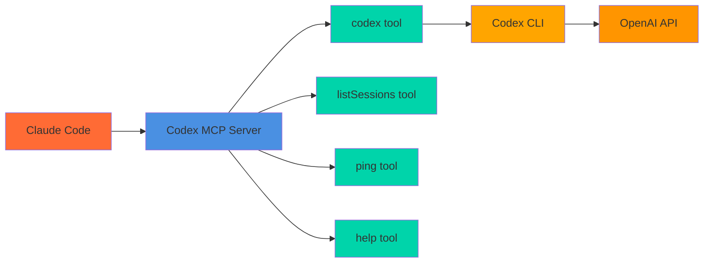

# Codex MCP Server

MCP server wrapper for OpenAI Codex CLI that enables Claude Code to leverage Codex's AI capabilities directly.



## Prerequisites

- **OpenAI Codex CLI** must be pre-installed and configured
  - Install: `npm i -g @openai/codex` or `brew install codex`
  - Setup: Run `codex login` or set `OPENAI_API_KEY` environment variable
- **Claude Code** installed

## Installation

### One-Click Installation

#### VS Code

[](https://vscode.dev/redirect/mcp/install?name=codex-cli&config=%7B%22type%22%3A%22stdio%22%2C%22command%22%3A%22npx%22%2C%22args%22%3A%5B%22-y%22%2C%22%40comfucios%2Fcodex-mcp-server%22%5D%7D)

#### VS Code Insiders

[](https://insiders.vscode.dev/redirect/mcp/install?name=codex-cli&config=%7B%22type%22%3A%22stdio%22%2C%22command%22%3A%22npx%22%2C%22args%22%3A%5B%22-y%22%2C%22%40comfucios%2Fcodex-mcp-server%22%5D%7D)

#### Cursor

[](https://cursor.com/en/install-mcp?name=codex&config=eyJ0eXBlIjoic3RkaW8iLCJjb21tYW5kIjoibnB4IC15IEBjb21mdWNpb3MvY29kZXgtbWNwLXNlcnZlciIsImVudiI6e319)

### Manual Installation

#### Claude Code

```bash
claude mcp add codex-cli -- npx -y @comfucios/codex-mcp-server
```

#### Claude Desktop

Add to your Claude Desktop configuration file:

**macOS:** `~/Library/Application Support/Claude/claude_desktop_config.json`
**Windows:** `%APPDATA%/Claude/claude_desktop_config.json`

```json
{
  "mcpServers": {
    "codex-cli": {
      "command": "npx",
      "args": ["-y", "@comfucios/codex-mcp-server"]
    }
  }
}
```

## Advanced Features & Tips

## Advanced Features

- **Graceful Shutdown:** The server handles SIGINT and SIGTERM for clean shutdowns, ensuring clients do not see abrupt disconnects.
- **Pagination:** Large outputs are split into pages, with `nextPageToken` and `pageToken` for navigation. Control default size with `CODEX_PAGE_SIZE`.
- **Session Management:** Use `sessionId` for conversational context, with automatic expiration (TTL configurable via `CODEX_SESSION_TTL_MS`).
- **Tool Discovery:** Call `listTools` to get a machine-readable list of all available tools and their schemas for client introspection.

## Environment Variables

You can configure the server using the following environment variables:

- `CODEX_PAGE_SIZE`: Default page size for paginated outputs (default: 40000, min: 1000, max: 200000).
- `CODEX_SESSION_TTL_MS`: Session time-to-live in milliseconds (default: 3600000, i.e., 1 hour).
- `OPENAI_API_KEY`: Your OpenAI API key (required for Codex CLI).

Set these in your shell or `.env` file as needed.

## Troubleshooting

**Common Issues:**

- **Codex CLI not found:**
  - Ensure `@openai/codex` is installed globally (`npm i -g @openai/codex` or `brew install codex`).
  - Check your `PATH` includes the directory where Codex CLI is installed.
- **Missing API key:**
  - Set the `OPENAI_API_KEY` environment variable or run `codex login`.
- **No config file found:**
  - Create a config file at `~/.codex/config.toml`, `~/.codex/config.yaml`, or `~/.codex/config.json`.
- **Session expired:**
  - Sessions expire after the configured TTL. Use a new `sessionId` or adjust `CODEX_SESSION_TTL_MS`.
- **Large output truncated:**
  - Use pagination (`nextPageToken`/`pageToken`) or increase `CODEX_PAGE_SIZE`.

If you encounter other issues, check logs or open an issue on the project repository.

### Error Handling

All tools return structured error messages for invalid arguments, tool names, or execution failures. Errors are always returned in a consistent format:

```json
{
  "isError": true,
  "content": [{ "type": "text", "text": "Error message here" }]
}
```

**Examples:**

- Invalid tool name:
  ```json
  {
    "isError": true,
    "content": [{ "type": "text", "text": "Unknown tool: fooBar" }]
  }
  ```
- Invalid arguments:
  ```json
  {
    "isError": true,
    "content": [
      {
        "type": "text",
        "text": "Validation failed for tool 'codex': Missing required 'prompt' (or provide a 'pageToken')."
      }
    ]
  }
  ```
- Execution failure:
  ```json
  {
    "isError": true,
    "content": [
      {
        "type": "text",
        "text": "Failed to execute tool 'codex': Codex CLI not found"
      }
    ]
  }
  ```

All errors include a clear message and the tool name for easier debugging.

### Tool Discovery & Introspection

You can discover all available tools and their schemas by calling the `listTools` tool. This returns a machine-readable list of all supported tools, their descriptions, and input schemas—ideal for client introspection and dynamic UI generation.

**Example:**

```json
{ "tool": "listTools" }
```

The response will be a JSON array describing each tool and its parameters.

## Advanced Features & Tips

- **Session Management:**
  - Provide a `sessionId` to maintain conversational context across multiple Codex calls.
  - Use `resetSession: true` to clear the context for a session (start fresh).
  - **Session Expiration:** Sessions expire automatically after a configurable time-to-live (TTL). By default, sessions last for 1 hour. You can change this by setting the `CODEX_SESSION_TTL_MS` environment variable (milliseconds). Expired sessions are cleaned up automatically.
  - List all active sessions with metadata (sessionId, number of turns, bytes, timestamps, expiration) using the `listSessions` tool.
  - Delete a session using the `deleteSession` tool.
  - Get statistics and metadata for a session using the `sessionStats` tool.
  - If `sessionId` is omitted, each call is stateless.
- **Pagination:**
  - Large outputs are split into pages. Use the `nextPageToken` from the response to fetch additional output with the `pageToken` parameter.
  - You can control the default page size with the `CODEX_PAGE_SIZE` environment variable (default: 40000, min: 1000, max: 200000).
  - You can also override the page size for a single request by passing the `pageSize` parameter to the tool call.
- **Error Handling:**
  - Invalid tool names or arguments return structured error messages in the response.
- **Tool Discovery:**
  - The MCP protocol supports listing all available tools and their schemas for client introspection.
- **Graceful Shutdown:**
  - The server handles `SIGINT` and `SIGTERM` for clean shutdowns, ensuring clients do not see abrupt disconnects.

## Usage in Claude Code

Once installed, Claude Code can use these tools:

### `codex` - AI Coding Assistant

Ask Codex to analyze code, generate solutions, or provide coding assistance.

**Usage:**

```
Use the codex tool to explain this function:
[paste your code here]
```

**Parameters:**

- `prompt` (optional): Your coding question or request. Required on the first call.
- `pageSize` (optional, number): Approximate characters per page (default 40,000).
- `pageToken` (optional, string): Opaque token returned from a previous call to fetch the next chunk of output.
- `sessionId` (optional, string): Stable ID to enable conversational context across calls.
- `resetSession` (optional, boolean): If true, clears the session identified by sessionId.

### `listSessions` - List Active Sessions

Useful for debugging or selecting a session to clear. if you want to clear the session you can use the `resetSession` parameter.

### `deleteSession` - Delete a Session

Delete or expire a session by sessionId.

**Usage:**

```json
{ "tool": "deleteSession", "sessionId": "abc123" }
```

### `sessionStats` - Session Statistics

Get statistics and metadata for a session.

**Usage:**

```json
{ "tool": "sessionStats", "sessionId": "abc123" }
```

### `ping` - Connection Test

Test if the MCP server is working properly.

### `help` - Codex CLI Help

Get information about Codex CLI capabilities and commands.

## Example Workflows

**Code Analysis:**

```
Please use the codex tool to review this TypeScript function and suggest improvements
```

**Bug Fixing:**

```
Use codex to help debug this error: [error message]
```

**Code Generation:**

```
Ask codex to create a React component that handles file uploads
```

**List all sessions with metadata:**

```json
{ "tool": "listSessions" }
```

**Delete a session:**

```json
{ "tool": "deleteSession", "sessionId": "abc123" }
```

**Get session statistics:**

```json
{ "tool": "sessionStats", "sessionId": "abc123" }
```

### `listModels` – Dynamic Model Listing

Lists all available Codex models and their descriptions by reading your Codex configuration files.

**How it works:**

- The server searches for a config file in your home directory:
  - `~/.codex/config.toml`
  - `~/.codex/config.yaml`
  - `~/.codex/config.json`
- It parses the config to extract all defined models, including those in profiles.
- The tool returns a unique list of model names and their descriptions.

**Example config (`~/.codex/config.toml`):**

```toml
model = "o4-mini"
model_provider = "openai"

[profiles]
gpt3 = { model = "gpt-3.5-turbo", model_provider = "openai-chat-completions" }
o3 = { model = "o3", model_provider = "openai" }
```

**Example Output:**

```
- o4-mini: Provider: openai
- gpt-3.5-turbo: Profile: gpt3, Provider: openai-chat-completions
- o3: Profile: o3, Provider: openai
```

**If no config file is found:**  
You’ll receive a helpful error message explaining how to add one.

> Supported config formats: TOML, YAML, JSON.

**Example Output:**

```
- o4-mini: Provider: openai
- gpt-3.5-turbo: Profile: gpt3, Provider: openai-chat-completions
- o3: Profile: o3, Provider: openai
```

**If no config file is found:**  
You’ll receive a helpful error message explaining how to add one.

> Supported config formats: TOML, YAML, JSON.

### Pagination Example

When Codex’s output is very large, the server automatically returns a `nextPageToken` in the result. You can use this token to fetch subsequent chunks:

1. First call:
   ```json
   { "tool": "codex", "prompt": "...", "pageSize": 10000 }
   ```
   (Response includes `nextPageToken` if more output is available)
2. Next page:
   ```json
   { "tool": "codex", "pageToken": "<nextPageToken>" }
   ```

## Development

```bash
# Install dependencies
npm install

# Development mode
npm run dev

# Build
npm run build

# Start built server
npm start
```

## Testing & Quality

This project uses **Jest** for unit and integration testing. Handlers, server logic, and tool integrations are covered with both unit and light integration tests (mocking external dependencies and CLI calls).

### Run All Tests

```bash
npm test
```

### Watch Tests

```bash
npm run test:watch
```

### Test Coverage

```bash
npm run test:coverage
```

This will output a coverage summary for statements, branches, functions, and lines.

### Linting & Formatting

Lint code with:

```bash
npm run lint
```

Auto-fix lint errors:

```bash
npm run lint:fix
```

Format code with Prettier:

```bash
npm run format
```

## License

ISC
